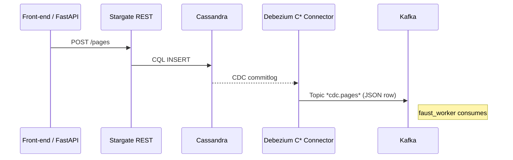

# 01\_cdc\_setup.md – **Ignite Cassandra CDC ↦ Kafka**

> **Sprint 2 – Block 0‑1 h**  |  Author ✍️ ***You + Gemini***
>
> **Goal:** Every mutation to `gibsey.pages` produces a JSON event on Kafka topic **`cdc.pages`** within 3 s.

---

## 1 Why We Need This

| Need                                                      | CDC Delivers                                                                 |
| --------------------------------------------------------- | ---------------------------------------------------------------------------- |
| *Instant learning* – new/edited pages must update vectors | Zero‑lag stream → Faust embed worker                                         |
| *Separation of concerns*                                  | Writers publish via Stargate → CDC fan‑out to every downstream micro‑service |
| *Replayable history*                                      | Kafka retains every change → future recompute, audits, or ML fine‑tune       |

---

## 2 Prerequisites

* **Docker 24+ / Compose v2** (`docker compose version` ➜ 2.x)
* Port availability: 7000‑7100 (Cassandra), 9042 (CQL), 9043 (Stargate gRPC), 8080 (Stargate REST), 2181 (ZK), 9092 (Kafka), 8083 (Kafka Connect)
* Local JDK 11+ (Debezium wrapper needs it, but inside container—it’s fine)
* Repo root contains:

  * `conf/cassandra.yaml` (custom copy – see below)
  * `schema/pages.cql` (table definition seeded earlier)
  * `docker-compose.cdc.yml` (full stack)
  * `debezium/cassandra-source.json` (connector config)

---

## 3 High‑Level Flow



---

## 4 Step‑by‑Step Setup

\### 4.1 Enable CDC in Cassandra

1. Duplicate the stock config:

   ```bash
   cp $(docker run --rm cassandra:4.1 cat /etc/cassandra/cassandra.yaml) conf/cassandra.yaml
   ```
2. Edit **`conf/cassandra.yaml`**:

   ```yaml
   cdc_enabled: true
   cdc_raw_directory: /var/lib/cassandra/cdc_raw
   # optional tuning
   commitlog_sync_period: 5000   # ms – lower for faster dev refresh
   ```

\### 4.2 Mark the Target Table as CDC‑Aware
After your keyspace + table exist (see `schema/pages.cql`):

```bash
docker exec -it cassandra cqlsh -e "ALTER TABLE gibsey.pages WITH cdc = true;"
```

\### 4.3 Spin the Full Stack
`docker-compose.cdc.yml` (excerpt – full file in repo):

```yaml
services:
  cassandra:
    image: cassandra:4.1
    container_name: cassandra
    volumes:
      - ./conf/cassandra.yaml:/etc/cassandra/cassandra.yaml
    environment:
      - CASSANDRA_DC=local
      - HEAP_NEWSIZE=512M
      - MAX_HEAP_SIZE=2G
    ports: ["9042:9042"]

  zookeeper:
    image: confluentinc/cp-zookeeper:7.6.0
    environment:
      ZOOKEEPER_CLIENT_PORT: 2181
    ports: ["2181:2181"]

  kafka:
    image: confluentinc/cp-kafka:7.6.0
    environment:
      KAFKA_ZOOKEEPER_CONNECT: zookeeper:2181
      KAFKA_ADVERTISED_LISTENERS: PLAINTEXT://kafka:9092,PLAINTEXT_HOST://localhost:9092
      KAFKA_OFFSETS_TOPIC_REPLICATION_FACTOR: 1
    ports: ["9092:9092"]

  debezium:
    image: debezium/connect:2.6
    depends_on: [kafka]
    environment:
      - BOOTSTRAP_SERVERS=kafka:9092
      - GROUP_ID=gibsey-connect
      - CONFIG_STORAGE_TOPIC=gibsey_connect_configs
      - OFFSET_STORAGE_TOPIC=gibsey_connect_offsets
      - KEY_CONVERTER_SCHEMAS_ENABLE=false
      - VALUE_CONVERTER_SCHEMAS_ENABLE=false
    ports: ["8083:8083"]
    volumes:
      - ./debezium:/kafka/connect/debezium
```

Bring it up:

```bash
docker compose -f docker-compose.cdc.yml up -d
```

\### 4.4 Register the Debezium Connector
`debezium/cassandra-source.json`:

```json
{
  "name": "gibsey-cassandra-source",
  "config": {
    "connector.class": "io.debezium.connector.cassandra.CassandraConnector",
    "tasks.max": "1",
    "topics.prefix": "cdc",
    "cassandra.contact.points": "cassandra",
    "cassandra.port": "9042",
    "cassandra.keyspace.blacklist": "system,system_schema",
    "cassandra.connection.auth.type": "None",
    "cdc.raw.directory": "/var/lib/cassandra/cdc_raw",
    "errors.log.enable": "true",
    "errors.log.include.messages": "true"
  }
}
```

Register:

```bash
curl -X POST localhost:8083/connectors -H 'Content-Type: application/json' \
     -d @debezium/cassandra-source.json
```

\### 4.5 Smoke Test

1. Insert a dummy page:

   ```bash
   curl -X POST localhost:8080/v2/keyspaces/gibsey/pages \
     -H "X-Cassandra-Token:$STARGATE_AUTH_TOKEN" \
     -d '{"page_id":"999","body":"CDC smoke test"}'
   ```
2. Watch Kafka:

   ```bash
   kcat -b localhost:9092 -t cdc.pages -C -o -1 -u | jq . | head -n 20
   ```

   *Expect*: JSON row with `"page_id":"999"` and operation `"op":"c"`.

✅ If you see the event, CDC is live—proceed to Embed Worker.

---

## 5 Troubleshooting

| Symptom                  | Check                       | Fix                                                                           |
| ------------------------ | --------------------------- | ----------------------------------------------------------------------------- |
| No events on `cdc.pages` | Is table `WITH cdc = true`? | Re‑run ALTER; flush `nodetool drain` + restart                                |
| Connector fails to start | Port / DNS issues           | Ensure `cassandra` host resolves inside Debezium container (`ping cassandra`) |
| `cdc_raw` fills disk     | Dev loop flood              | `nodetool clearsnapshot` + raise `cdc_total_space_in_mb`                      |

---

## 6 Clean‑Up

```bash
docker compose -f docker-compose.cdc.yml down -v
rm -rf conf/cassandra/ commitlog/*
```

---

## 7 Time‑Box Checklist (45 min target)

* [ ] Copy / edit `conf/cassandra.yaml` (5 min)
* [ ] Compose stack up (8 min build pull)
* [ ] Connector POST (2 min)
* [ ] Smoke insert + `kcat` verify (3 min)
* [ ] Commit + push (`docs/01_cdc_setup.md`, config, compose) (2 min)

Total ≈ **20 min hands‑on**, 45 min wall‑clock (images pull).

---

## 8 Hand‑Off Notes for Gemini

> “Use `docs/01_cdc_setup.md` end‑to‑end. When connector is live, move to `02_stargate_quickstart.md`. If `kcat` shows events, mark Step 1 complete and start coding Faust worker.”

*End of file 🌱*
