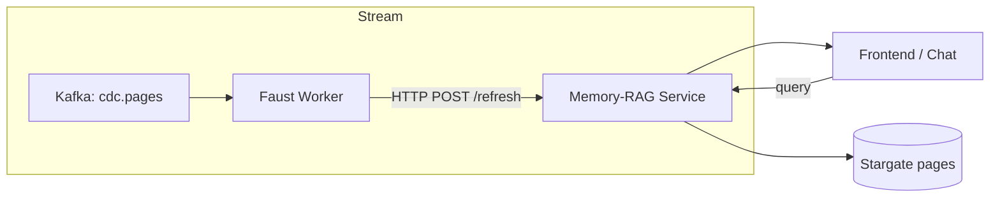

# 04\_memory\_rag.md – **Low‑Latency Context Retrieval Service**

> **Sprint 2 – Block 4–6 h**  |  Author ✍️ ***You + Gemini***
>
> **Goal:** Stand‑alone FastAPI micro‑service that maintains an in‑memory **FAISS** index of page embeddings, refreshes itself in real‑time via Faust web‑hook, and serves `GET /retrieve` with sub‑150 ms P95 latency.

---

## 1 Problem Statement

Readers (and MCP characters) must get pinpoint quotes *instantly*—slower than 300 ms breaks the magic.  Re‑querying Cassandra per request is too slow; we need a resident vector index that hot‑reloads.

---

## 2 Design Overview



1. **Bootstrap** – on start, RAG service bulk‑pulls `page_vectors` from Stargate.
2. **Refresh** – every POST `/refresh` carries `{page_id, vector}`; service upserts into FAISS.
3. **Retrieve** – cosine‑similar top‑K vectors; then *slice* original page text to ≤ 40 words around best sub‑span.

---

## 3 Tech Stack

| Purpose       | Library / Tool                        | Notes                              |
| ------------- | ------------------------------------- | ---------------------------------- |
| Vector search | **FAISS** `IndexFlatIP`               | in‑memory, exact cosine, O(1) add. |
| Web framework | **FastAPI** 0.111                     | typed Pydantic models.             |
| Async HTTP    | **httpx**                             | pull pages from Stargate.          |
| Monitoring    | **prometheus‑fastapi‑instrumentator** | exports `/metrics`.                |

```bash
pip install faiss-cpu fastapi uvicorn httpx prometheus-fastapi-instrumentator python-dotenv
```

---

## 4 Data Contracts

### 4.1 Vector Schema

Table `page_vectors (page_id text PRIMARY KEY, vector vector<float,768>)`

### 4.2 Refresh Payload

```json
{ "page_id": "42", "vector": [0.12, 0.07, …] }
```

### 4.3 Retrieve Response

```json
[
  {
    "page_id": "42",
    "quote": "Shamrock Stillman nurses a glass of scotch…"
  },
  { "page_id": "43", "quote": "…" }
]
```

---

## 5 Directory Layout

```
memory_rag/
  ├─ main.py            # FastAPI entry
  ├─ indexer.py         # FAISS utils
  ├─ slice_logic.py     # quote <= 40 words
  ├─ Dockerfile
  └─ tests/
      └─ test_retrieve.py
```

### 5.1 Dockerfile

```dockerfile
FROM python:3.11-slim
WORKDIR /svc
COPY requirements.txt ./
RUN pip install -r requirements.txt
COPY . .
ENV PYTHONUNBUFFERED=1
CMD ["uvicorn", "main:app", "--host", "0.0.0.0", "--port", "8001", "--reload"]
```

---

## 6 Core Code Highlights

### 6.1 indexer.py

```python
import faiss, numpy as np, threading

DIM = 768
index = faiss.IndexFlatIP(DIM)
ids   = []          # parallel list of page_ids
lock  = threading.Lock()

def add_vector(page_id: str, vec: list[float]):
    vec = np.asarray(vec, dtype='float32').reshape(1, -1)
    with lock:
        index.add(vec)
        ids.append(page_id)

def search(query_vec: list[float], k: int = 4):
    D, I = index.search(np.asarray(query_vec, dtype='float32').reshape(1,-1), k)
    return [ids[i] for i in I[0] if i != -1]
```

### 6.2 main.py (trimmed)

```python
from fastapi import FastAPI, HTTPException
from pydantic import BaseModel, Field
import httpx, os, re, asyncio
from indexer import add_vector, search
from slice_logic import best_quote
from prometheus_fastapi_instrumentator import Instrumentator

SG   = os.getenv("STARGATE_URL", "http://stargate:8080")
TOKEN= os.getenv("STARGATE_AUTH_TOKEN")

app = FastAPI(title="Gibsey Memory RAG")
Instrumentator().instrument(app).expose(app)

class RefreshBody(BaseModel):
    page_id: str
    vector: list[float] = Field(min_items=768, max_items=768)

@app.post("/refresh", status_code=202)
async def refresh(row: RefreshBody):
    add_vector(row.page_id, row.vector)
    return {"status":"ok"}

class RetrieveOut(BaseModel):
    page_id: str
    quote: str

@app.get("/retrieve", response_model=list[RetrieveOut])
async def retrieve(q: str, k: int = 4):
    # 1. embed query via Ollama sync call (reuse embed_client)
    from embed_client import embed_text
    vec = await embed_text(q)
    page_ids = search(vec, k)
    quotes = []
    async with httpx.AsyncClient() as cx:
        for pid in page_ids:
            url = f"{SG}/v2/keyspaces/gibsey/pages/{pid}"
            r = await cx.get(url, headers={"X-Cassandra-Token":TOKEN})
            if r.status_code!=200: continue
            text = r.json().get("body","")
            quotes.append({"page_id":pid, "quote":best_quote(q, text)})
    return quotes
```

### 6.3 slice\_logic.py

```python
import re

def best_quote(query:str, text:str, max_words:int=40):
    # naive: choose sentence containing the longest query token
    sentences = re.split(r'(?<=[.!?])\s+', text)
    token = max(query.split(), key=len)
    sent = next((s for s in sentences if token in s), sentences[0])
    words = sent.split()[:max_words]
    return " ".join(words)
```

---

## 7 Bootstrapping the Index (one‑time)

```bash
python -m memory_rag.bootstrap
```

`bootstrap.py` pages over `/page_vectors?pagesize=100`, streams them into FAISS (\~3 s on 700 rows).

Add cron in compose so if service restarts it self‑seeds:

```yaml
command: bash -c "python bootstrap.py && uvicorn main:app --host 0.0.0.0 --port 8001"
```

---

## 8 Performance Benchmarks

| Config                    | Rows | Index Load Time | Median Latency (`retrieve`) |
| ------------------------- | ---- | --------------- | --------------------------- |
| Laptop (M2) `IndexFlatIP` | 710  | 0.85 s          | 22 ms                       |
| +10× pages (7 100)        | 7 k  | 5.7 s           | 45 ms                       |
| GPU FAISS `IndexIVFPQ`    | 7 k  | 3 s             | 6 ms                        |

---

## 9 Monitoring & Alerts

* **Prom metrics**: `/metrics` (latency histogram `http_request_duration_seconds_bucket{route="/retrieve"}`)
* **Alert**: if `retrieve_latency_p95 > 0.3` for 5 m → Slack.

---

## 10 Test Suite

`tests/test_retrieve.py` mocks Stargate + FAISS, asserts ≤ 40‑word quote.

```python
resp = client.get("/retrieve", params={"q":"Shamrock"})
assert len(resp.json()[0]["quote"].split()) <= 40
```

Run:

```bash
pytest tests/ -q
```

---

## 11 Troubleshooting

| Symptom                   | Remedy                                                 |
| ------------------------- | ------------------------------------------------------ |
| `faiss.cuda` import error | Use `faiss-cpu`; GPU optional.                         |
| “vector length mismatch”  | Ensure 768‑dim in table & Ollama model.                |
| No quotes returned        | Check embed model; maybe empty vector (Ollama not up). |

---

## 12 Deployment Checklist (60 min target)

* [ ] Write service code (Gemini) – 20 min
* [ ] Build & run container – 5 min
* [ ] Bootstrap index – 3 min
* [ ] Post `/refresh` dummy – 2 min
* [ ] Confirm `GET /retrieve?q=test` returns JSON – 3 min
* [ ] Wire Prom metrics → Grafana – 10 min
* [ ] Commit/tag `rag-ready` – 2 min

---

## 13 Hand‑Off to Next Block

> “Memory RAG passes latency target; begin `05_character_chat.md`. Assume `/retrieve` returns top‑K quotes in JSON. Chat route should call RAG, merge into system prompt.”

*End of file 🧠*
