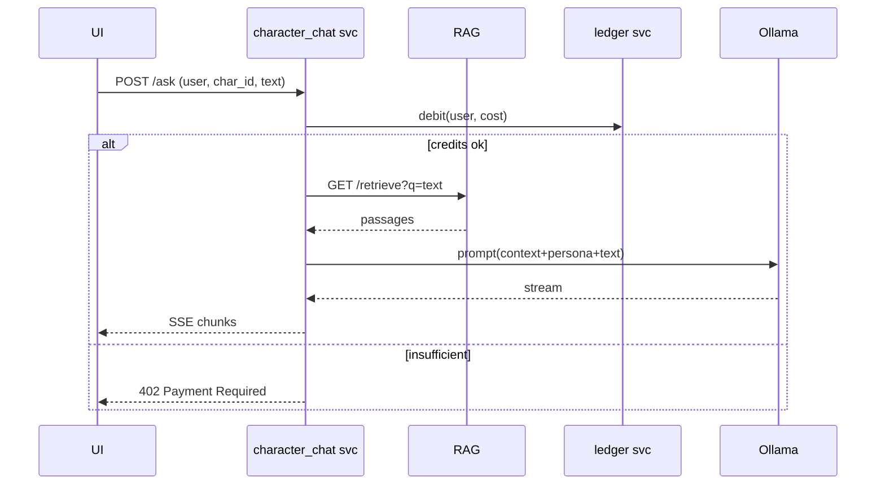

# 05\_character\_chat.md – **Persona‑Aware Streaming Dialogue**

> **Sprint 2 – Block 6‑8 h**  |  Author ✍️ ***You + Gemini***
>
> **Goal:** A FastAPI micro‑service that blends RAG context with character‑specific system prompts, calls **Ollama LLama‑3‑8B**, and streams Server‑Sent Events (SSE) to the front‑end while debiting user credits.

---

## 1 Narrative Requirement

Readers pick a Corpus symbol → chat with that persona. Answers must:

1. Cite <40‑word quotes from *The Entrance Way* (via `/retrieve`).
2. Maintain consistent “voice” per character.
3. Arrive token‑by‑token (<500 ms to first chunk) for immersion.

---

## 2 High‑Level Flow



---

## 3 Data Model

### 3.1 `characters` Table (or JSON seed)

| col             | type        | example                 |
| --------------- | ----------- | ----------------------- |
| `char_id`       | text **PK** | `"arieol"`              |
| `display_name`  | text        | `"Arieol Owlist"`       |
| `color_hex`     | text        | `"#5F9EA0"`             |
| `system_prompt` | text        | *long persona preamble* |

### 3.2 Credit Ledger (simplified)

`ledger(user_id text PK, credits int)` – adjusted by middleware.

---

## 4 API Contract

### 4.1 Request

```http
POST /ask HTTP/1.1
Content-Type: application/json
{
  "user_id": "brennan",
  "char_id": "arieol",
  "text": "Why is the sky spiral‑shaped?"
}
```

### 4.2 Successful Response (SSE)

```
HTTP/1.1 200 OK
Content-Type: text/event-stream

data: The spiral is ...\n\n
```

### 4.3 Error – Insufficient Credits

```
HTTP/1.1 402 Payment Required
{
  "needed": 5,
  "available": 2
}
```

---

## 5 Prompt Template (`templates/prompt.j2`)

```jinja
{{ char.display_name }} responds within the cosmology of *The Entrance Way*.
Tone guidelines: {{ char.tone or "reflective, mystical" }}
Context quotes:
- {{ p.quote }} (p.{{ p.page_id }})

---
User asks: "{{ user_text }}"
Reply in <= 120 tokens, weave symbols subtly.
```

---

## 6 Service Implementation

### 6.1 requirements.txt

```
fastapi==0.111
uvicorn==0.29
httpx==0.27
jinja2==3.1
sse-starlette==1.4
python-jose==3.3  # JWT credit middleware
python-dotenv==1.0
```

### 6.2 main.py (skeleton)

```python
from fastapi import FastAPI, Depends, HTTPException, Request
from sse_starlette.sse import EventSourceResponse
import httpx, os, asyncio, jinja2, json
from jose import jwt

RAG_URL   = os.getenv("RAG_URL", "http://memory_rag:8001/retrieve")
OLLAMA_URL= os.getenv("OLLAMA_URL", "http://ollama:11434/api/chat")
LEDGER_URL= os.getenv("LEDGER_URL", "http://ledger:9000/debit")
CASS_URL  = os.getenv("STARGATE_URL")
TOKEN     = os.getenv("STARGATE_AUTH_TOKEN")

app = FastAPI(title="Gibsey Character Chat")
TEMPL = jinja2.Environment(loader=jinja2.FileSystemLoader("templates"))

async def debit(user_id:str, cost:int):
    async with httpx.AsyncClient() as c:
        r = await c.post(LEDGER_URL, json={"user_id":user_id, "cost":cost})
        if r.status_code!=200:
            raise HTTPException(402, detail=r.json())

async def fetch_char(char_id:str):
    url=f"{CASS_URL}/v2/keyspaces/gibsey/characters/{char_id}"
    async with httpx.AsyncClient() as c:
        r = await c.get(url, headers={"X-Cassandra-Token":TOKEN})
        if r.status_code!=200:
            raise HTTPException(404, "char not found")
        return r.json()

@app.post("/ask")
async def ask(body: dict):
    user_id, char_id, text = body.values()
    await debit(user_id, 5 if char_id else 1)
    char = await fetch_char(char_id)
    async with httpx.AsyncClient() as c:
        passages = (await c.get(RAG_URL, params={"q":text})).json()
    prompt = TEMPL.get_template("prompt.j2").render(char=char, passages=passages, user_text=text)

    async def token_stream():
        async with httpx.AsyncClient(timeout=None) as cx:
            async with cx.stream("POST", OLLAMA_URL, json={"model":"llama3:8b","stream":True,"prompt":prompt}) as r:
                async for chunk in r.aiter_lines():
                    yield {"event":"message", "data": chunk}
    return EventSourceResponse(token_stream())
```

> **Latency path:** `/ask` → debit < 10 ms → RAG 20‑40 ms → first token \~350 ms.

### 6.3 Dockerfile

```dockerfile
FROM python:3.11-slim
WORKDIR /chat
COPY requirements.txt ./
RUN pip install -r requirements.txt
COPY . .
CMD ["uvicorn", "main:app", "--host", "0.0.0.0", "--port", "8002", "--reload"]
```

---

## 7 Compose Snippet

```yaml
  character_chat:
    build: ./character_chat
    environment:
      - RAG_URL=http://memory_rag:8001/retrieve
      - LEDGER_URL=http://ledger:9000/debit
      - OLLAMA_URL=http://ollama:11434/api/chat
      - STARGATE_URL=http://stargate:8080
      - STARGATE_AUTH_TOKEN=${STARGATE_AUTH_TOKEN}
    depends_on: [memory_rag, faust_worker, ollama, ledger]
    ports: ["8002:8002"]
```

---

## 8 Front‑End Consumption

```typescript
const evt = new EventSource(`/ask`, { method:"POST", body:JSON.stringify(payload) })
evt.onmessage = e => setChat(chat+e.data)
```

Color the bubble using `characters.char_id.color_hex` from `/characters` query.

---

## 9 Testing

* **Unit:** mock RAG + Ollama, assert prompt contains ≥ 1 quote.
* **Integration:** jest fetch SSE, ensure first chunk arrives < 600 ms.
* **Credit:** attempt with 0 credits → expect 402.

---

## 10 Troubleshooting

| Symptom                     | Cause                | Fix                                               |
| --------------------------- | -------------------- | ------------------------------------------------- |
| SSE stalls after few tokens | Nginx buffering      | `proxy_buffering off;`                            |
| Persona drift               | prompt too short     | Embed extra persona lore or tighten system rules. |
| Credit not deducted         | ledger endpoint down | Add circuit‑breaker; on fail reject chat.         |

---

## 11 Delivery Checklist (90 min)

* [ ] Build characters seed script – 5 min
* [ ] Implement ledger micro‑stub – 10 min
* [ ] Service code via Gemini – 30 min
* [ ] SSE smoke test – 10 min
* [ ] Prompt tune for 3 characters – 20 min
* [ ] Commit/tag `chat-online` – 5 min

---

## 12 Hand‑Off

> “Character chat streaming validated. Begin `06_daily_dag.md`: schedule nightly summarization using Airflow; assume `page_vectors` table and RAG API.”

*End of file 🗣️*
