# 06\_daily\_dag.md – **Nightly Knowledge Distillation**

> **Sprint 2 – Block 8–9 h**  |  Author ✍️ ***You + Gemini***
>
> **Goal:** A reproducible **Apache Airflow** DAG that clusters the latest `page_vectors`, generates 250‑word abstractive summaries with LLama‑3‑8B, and writes them to the `summaries` table every night at 03:00 local. Summaries seed higher‑level context for long conversations and future chapter views.

---

## 1 Rationale

| Problem                                            | Nightly DAG Benefit                                                                  |
| -------------------------------------------------- | ------------------------------------------------------------------------------------ |
| Raw pages are too granular for multi‑page queries. | Provides mid‑sized “chapter‑like” chunks (≤250 w) tuned to emergent vector clusters. |
| On‑demand clustering is compute heavy.             | Batch once nightly while traffic is low.                                             |
| We’ll soon need *secondary* context for DreamRIA.  | Summaries table doubles as feed for secondary AI personas.                           |

---

## 2 High‑Level Flow

```mermaid
flowchart TD
  subgraph Batch
    E[page_vectors] -->|pull| DAG[Airflow DAG]
    DAG --> CLU[HDBSCAN/KMeans]
    CLU --> LLM[LLama‑3‑8B Summarize]
    LLM --> S[summaries]
    S --> UI[Vault / Chapter View]
  end
```



---

## 3 Schema: `summaries`

```sql
CREATE TABLE summaries (
  cluster_id int PRIMARY KEY,
  center_page text,
  summary text,
  updated_at timestamp
);
```

*`cluster_id`* is deterministic (stable K‑Means seed) so down‑stream caches persist.

---

## 4 Airflow Setup

* **Image:** `apache/airflow:2.9-python3.11` (Docker compose).
* **Connections:**

  * `stargate_rest` → HTTP (base `http://stargate:8080`, extra: `{"token":"$STARGATE_AUTH_TOKEN"}`)
  * `ollama_chat`  → HTTP (base `http://ollama:11434`)
* **Env:** `AIRFLOW_UID=$(id -u)` so local volume permissions work.

### 4.1 docker‑compose.airflow\.yml (excerpt)

```yaml
services:
  airflow:
    image: apache/airflow:2.9-python3.11
    environment:
      - AIRFLOW__CORE__EXECUTOR=LocalExecutor
    volumes:
      - ./airflow/dags:/opt/airflow/dags
      - ./airflow/logs:/opt/airflow/logs
    ports: ["8088:8080"]
    depends_on: [stargate, ollama]
```

---

## 5 DAG Code (`dags/nightly_summarizer.py`)

```python
from airflow import DAG
from airflow.decorators import task
from airflow.utils.dates import days_ago
from pendulum import timezone
import httpx, os, numpy as np, json, hashlib, random
from sklearn.cluster import KMeans

SG   = os.getenv("STARGATE_URL", "http://stargate:8080")
TOKEN= os.getenv("STARGATE_AUTH_TOKEN")
OLL  = os.getenv("OLLAMA_URL", "http://ollama:11434/api/chat")
TZ   = timezone("America/Chicago")

def stargate_get(path):
    return httpx.get(f"{SG}{path}", headers={"X-Cassandra-Token":TOKEN}).json()

def stargate_put(path, body):
    return httpx.put(f"{SG}{path}", json=body, headers={"X-Cassandra-Token":TOKEN})

def summarize_txt(txt):
    payload={"model":"llama3:8b","stream":False,
             "prompt":f"Summarize in 250 words max:\n{txt}"}
    return httpx.post(OLL, json=payload, timeout=120).json()["response"].strip()

def cluster(vecs, k=48):
    km = KMeans(n_clusters=k, random_state=42).fit(vecs)
    return km.labels_, km.cluster_centers_

def representative_page(vecs, labels, pages):
    rep = {}
    for idx,l in enumerate(labels):
        if l not in rep:
            rep[l]=pages[idx]
    return rep

with DAG(
    "nightly_summarizer",
    start_date=days_ago(1),
    schedule_interval="0 3 * * *",
    catchup=False,
    max_active_runs=1,
    tags=["gibsey"],
    default_args={"retries":1}
) as dag:

    @task()
    def pull_vectors():
        data = stargate_get("/v2/keyspaces/gibsey/page_vectors?page-size=1000")
        vecs, pages = [], []
        for row in data["data"]:
            pages.append(row["page_id"])
            vecs.append(row["vector"])
        return {"vecs":vecs, "pages":pages}

    @task()
    def cluster_and_summarize(payload):
        vecs = np.array(payload["vecs"], dtype="float32")
        pages= payload["pages"]
        labels, _ = cluster(vecs, k=48)
        rep     = representative_page(vecs, labels, pages)
        batch   = {}
        for l,pid in rep.items():
            body = stargate_get(f"/v2/keyspaces/gibsey/pages/{pid}")["body"]
            batch[l] = {
                "center_page": pid,
                "summary": summarize_txt(body)
            }
        return batch

    @task()
    def write_summaries(batch):
        ts = int(__import__("time").time()*1000)
        for cid,data in batch.items():
            row = {
                "cluster_id": int(cid),
                "center_page": data["center_page"],
                "summary": data["summary"],
                "updated_at": ts
            }
            stargate_put(f"/v2/keyspaces/gibsey/summaries/{cid}", row)

    write_summaries(cluster_and_summarize(pull_vectors()))
```

---

## 6 Performance Targets

| Stage           | Budget                                   |
| --------------- | ---------------------------------------- |
| Vector pull     | < 20 s                                   |
| Clustering (48) | < 5 s on 700 vectors                     |
| Summary LLM     | ≤ 15 s each → parallel loop → total 60 s |
| Stargate writes | < 10 s                                   |
| Total DAG time  | **≤ 2 min 30 s**                         |

---

## 7 Monitoring & Alerting

* **Airflow UI** → DAG duration SLA `<150 s`.
* **Prometheus**: scrape task‑duration metric, alert if `duration_seconds{task="summarize"} > 30`.
* **Retry**: Airflow auto‑retry once; second failure sends email/Slack.

---

## 8 Local Test

```bash
docker compose -f docker-compose.airflow.yml up -d airflow
# In UI trigger DAG run manually
```

Check `summaries` table afterward:

```bash
curl $SG/v2/keyspaces/gibsey/summaries | jq '.data[0]'
```

---

## 9 Troubleshooting

| Issue                           | Check                      | Fix                                                      |
| ------------------------------- | -------------------------- | -------------------------------------------------------- |
|  `ModuleNotFoundError: sklearn` | Image missing dependencies | Add `scikit-learn==1.5` to `requirements.txt`.           |
| Empty summaries                 | LLM hit context window     | Ensure `body` ≤ 2 000 tokens or summarize incrementally. |
| DAG stuck in running            | LLM streaming never closes | Use `stream=False` payload; set HTTP timeout 120 s.      |

---

## 10 Delivery Checklist (45 min)

* [ ] Airflow compose up & metadatabase initialized.
* [ ] DAG file copied → container volume.
* [ ] Env connections set.
* [ ] Manual run completes < 3 min.
* [ ] Prometheus metric appears.
* [ ] Commit/tag `dag-ready`.

---

## 11 Hand‑Off

> “Nightly summarizer operational. Final block `07_smoke_tests.md`: capture p95 latency, RAG miss rate, SSE first‑token time in CI.”

*End of file 🌒*
