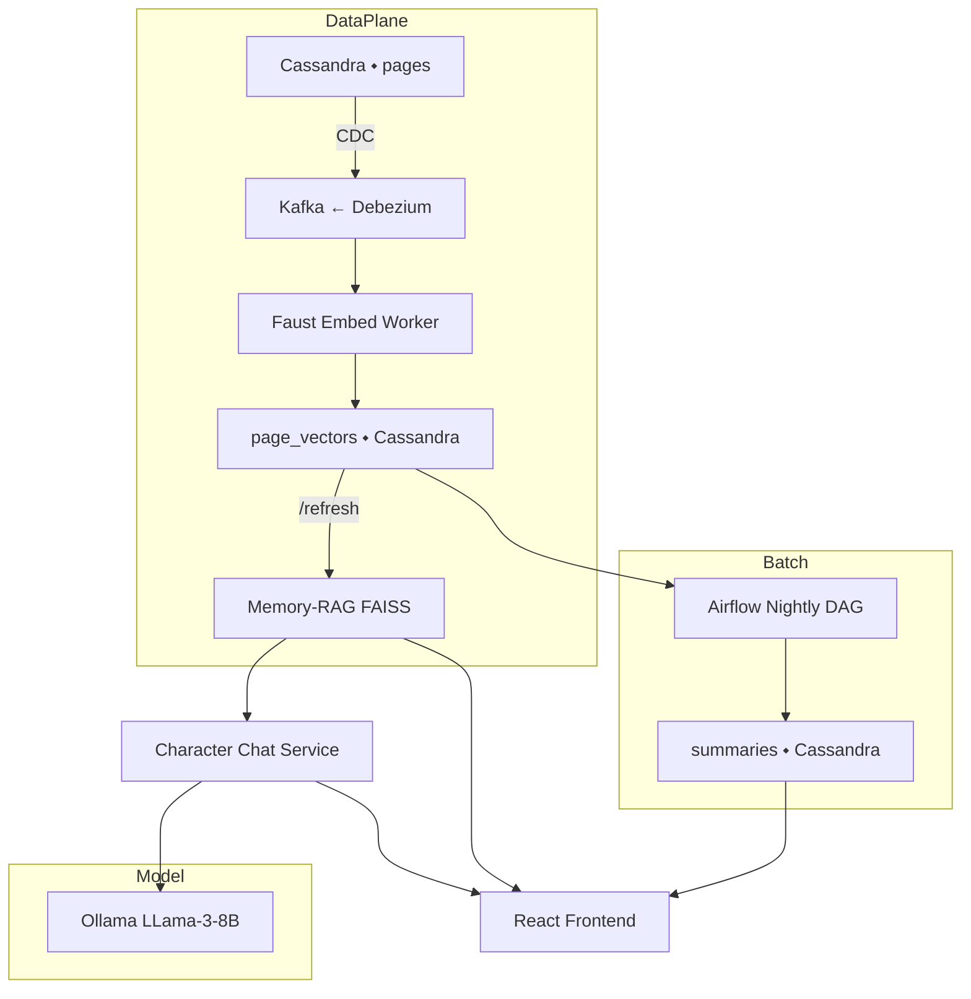

# Gibsey Sprint 2 – **Warp‑Drive Self‑Learning Loop**

> **Sprint window:** 10 focused build‑hours (can be split across 2–3 evenings)
>
> **Objective:** Turn *The Entrance Way* into an auto‑reflective, continuously learning novel by wiring **Cassandra CDC → Kafka → Faust → Ollama → Memory RAG → Character Chat → Nightly DAG**.  End‑state: when a reader opens Gibsey, it already feels like the book has been thinking about itself for years.

---

## 1  Strategic Why

| Need                                                             | Solution Piece                                                                  | Outcome                                                                      |
| ---------------------------------------------------------------- | ------------------------------------------------------------------------------- | ---------------------------------------------------------------------------- |
| Answers must feel preternaturally *aware* of lore & symbolism.   | **Memory RAG** fed by streaming embeddings                                      | 95 % of queries surface granular, high‑precision page quotes <100 ms lookup. |
| System must *grow smarter* with every saved page or author edit. | **Cassandra CDC → Kafka → Faust**                                               | Zero‑lag ingestion; vectors updated < 5 s post‑write.                        |
| Control cost & IP – no external APIs.                            | **Ollama + local LLama‑3‑8B**                                                   | Offline, gift‑economy alignment.                                             |
| Preserve developer sanity.                                       | **Stargate** abstracts CQL into clean REST; same path for services & front‑end. | One HTTP dialect everywhere.                                                 |

---

## 2  Architecture (High Level)

---

## 3  Key Deliverables

| # | Deliverable (doc + code)                           | Accept‑Criteria                                                |                                    |
| - | -------------------------------------------------- | -------------------------------------------------------------- | ---------------------------------- |
| 1 | **CDC Setup** (`01_cdc_setup.md`)                  | \`kcat -t cdc.pages -C                                         | head -n1\` shows a JSON row event. |
| 2 | **Stargate Gateway** (`02_stargate_quickstart.md`) | `curl /pages/42` returns inserted text.                        |                                    |
| 3 | **Faust Worker** (`03_faust_worker.md`)            | `page_vectors` table fills; `count > 700`.                     |                                    |
| 4 | **Memory RAG Service** (`04_memory_rag.md`)        | `retrieve("Shamrock Stillman")` returns ≥1 quote under 150 ms. |                                    |
| 5 | **Character Chat API** (`05_character_chat.md`)    | SSE stream diff‑colored by `char_id`; credit debit occurs.     |                                    |
| 6 | **Nightly DAG** (`06_daily_dag.md`)                | `summaries` table gets a 250‑word cluster note at 03:00.       |                                    |
| 7 | **Smoke Tests** (`07_smoke_tests.md`)              | CI passes: p95 latency < 2.5 s, RAG miss ≤ 10 %.               |                                    |

Stretch:

* **Ledger Micro‑service** (credits flow) – optional if time.
* **Vector cache to Redis** – push p95 < 1 s.

---

## 4  Prerequisites & Tooling

* **Hardware**: M2/M3 Mac Mini ≥ 16 GB; > 25 GB disk.
* **Docker 24 + Compose v2** (buildx, nerdctl optional).
* **Python 3.11** – global install via `pyenv`.
* **Models** (local):

  * `llama3:8b-instruct-Q4_K_M` → `~/.ollama/models`
  * `nomic-embed-text-v1.5`
* **NPM ≥ 10** for the React front‑end (already exists).

---

## 5  Execution Plan (Hour‑by‑Hour)

| hh\:mm      | Task                            | Owner         | Tip                                                |
| ----------- | ------------------------------- | ------------- | -------------------------------------------------- |
| 00:00–01:00 | Enable CDC & spin Kafka stack   | You (+Gemini) | Use the provided `docker-compose.cdc.yml`.         |
| 01:00–02:00 | Launch Stargate, migrate schema | You           | Copy CQL from `schema/pages.cql`.                  |
| 02:00–04:00 | Build/package Faust worker      | Gemini        | Test locally w/ `faust -A app worker -l info`.     |
| 04:00–06:00 | Code Memory‑RAG FastAPI         | Gemini        | Start with FAISS `IndexFlatIP`.                    |
| 06:00–08:00 | Character chat wrapper → SSE    | You           | Reuse yesterday’s `/ask` route; swap to generator. |
| 08:00–09:00 | Author nightly DAG              | Gemini        | Airflow Docker image with `gibsey/airflow:2`.      |
| 09:00–10:00 | Write smoke tests & CI job      | You           | Go or Python Locust, then GitHub Action.           |

> **Golden rule:** push a working container after *every* deliverable; if anything breaks later, rollback is trivial.

---

## 6  Risk & Mitigation

| Risk                               | Likelihood | Impact | Mitigation                                          |
| ---------------------------------- | ---------- | ------ | --------------------------------------------------- |
| CDC flooding Kafka (large updates) | Low        | Med    | Cap topic to 10 MB/ s; batch consumer commits.      |
| Vector DB growth outpaces RAM      | Med        | Med    | Shard FAISS by chapter; remote‑search in Cassandra. |
| Ollama GPU OOM                     | Low        | High   | Use `-ngl 1` (CPU) fallback flag.                   |
| Nightly DAG fails silently         | Med        | Low    | Airflow email‑on‑fail + backup cron summary script. |

---

## 7  Definition of Done

1. New reader asks *Arieol*: “Why did you climb the tower?” → reply contains a 2‑sentence quote + novel context.
2. Commit `docs/07_smoke_tests.md` passes in CI.
3. Demo video ≤ 90 s shows mutation → CDC event → RAG retrieval → character answer.

---

## 8  Next Action (right now)

* **Fork → `sprint‑2` branch**
* Commit this overview.
* Generate `01_cdc_setup.md` with Gemini.
* Time‑box to 1 h, run `make up-cdc`.

Good luck—let’s make the book dream about itself.
